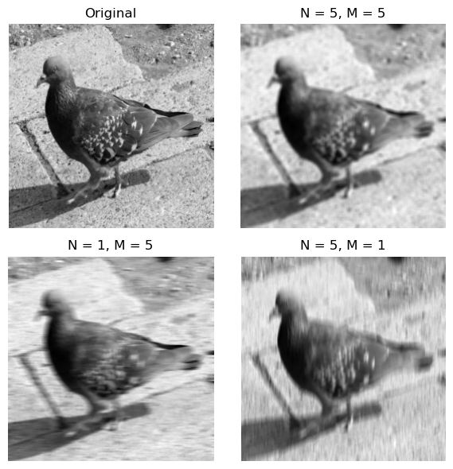

# Image Restoration
Malachi Hibbins

---

## What is Image Restoration

---

## Overview
- How and why do images degrade
  - Blurring
  - Shot noise
- Fourier analysis
  - Fourier transforms in 2D
  - (de)-convolution
- Richardson and Lucy
- Future Work: Machine learning

---

## Image blurring
- Blurring is a form of low pass filter
- The simplest bluing filter involves selecting a pixel $p'_{ij}$ (the filtered pixel) and setting this value to be the average of the $N$ pixels above and below and the $M$ pixels below.
$$\tag{1} p'_{x,y} = \frac{1}{(2N+1)(2M+1)} \sum_{n=-N}^{N} \sum_{m=-M}^{M} p_{x+n,y+m}$$
- This is called the box filter
---
## Image blurring
- The simplest bluing filter involves selecting a pixel $p'_{ij}$ (the filtered pixel) and setting this value to be the average of the $N$ pixels above and below and the $M$ pixels below.
- This is called the box filter
(Figure1.png)

---

## Fourier Transforms in 2D

---

## Convolution
The convolution of two functions is given by:
$$f(x) = v(x) * u(x) = \mathcal{F}^{-1}\{V(k) \cdot U(k)\} \tag{2}$$
